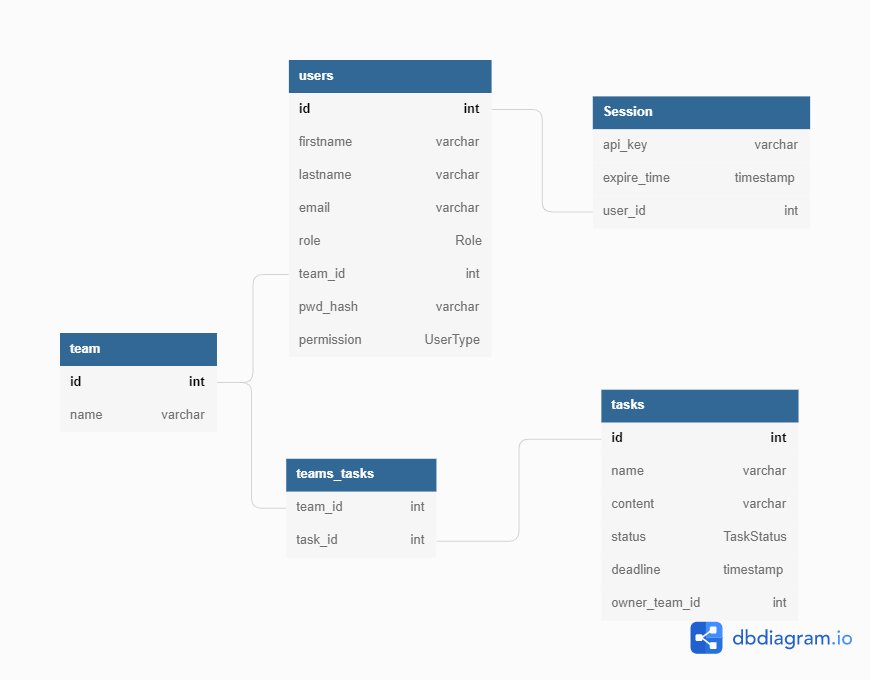

# Table of Contents
- [Table of Contents](#table-of-contents)
- [ชื่อ - นามสกุลผู้สมัคร](#ชื่อ---นามสกุลผู้สมัคร)
- [How to start](#how-to-start)
  - [Rust toolchain setup](#rust-toolchain-setup)
  - [Compile and run](#compile-and-run)
- [Troubleshoot](#troubleshoot)
  - [Program exit with code 3](#program-exit-with-code-3)
- [TODO](#todo)
- [โจทย์](#โจทย์)
  - [รายละเอียดโจทย์](#รายละเอียดโจทย์)
  - [งานของคุณ](#งานของคุณ)
    - [รายละเอียดของ Feature (Minimum Requirement)](#รายละเอียดของ-feature-minimum-requirement)
    - [User](#user)
    - [Task](#task)
    - [Other](#other)
    - [รายละเอียดของ Feature (Optional)](#รายละเอียดของ-feature-optional)
    - [Team](#team)
    - [Authentication](#authentication)
    - [Authorization](#authorization)
  - [การเก็บข้อมูล (Minimum)](#การเก็บข้อมูล-minimum)
- [API Specification](#api-specification)
- [DB Design](#db-design)
# ชื่อ - นามสกุลผู้สมัคร
ปัณณวิชญ์ โลหะนิมิต

# How to start
rust toolchain is required.
## Rust toolchain setup
[Rustup](https://www.rust-lang.org/learn/get-started)

## Compile and run
```sh
cargo run
```

# Troubleshoot
## [Program exit with code 3](https://github.com/diesel-rs/diesel/discussions/2947)

# TODO
- [x] use functor for api
- [x] find task by name
- [x] find user by firstname, lastname
- [x] assign task to user
- [ ] add properly do timestamp
- [x] rewrite api specification
- [ ] Redesign database for team
- [ ] Add DB Design
- [ ] Rewrite api specification
- [ ] Team (CRUD)
- [ ] Team Find
- [ ] Team assign user
- [ ] Team assign task
- [ ] TBD
- [ ] Docker if have excess time

# โจทย์

[//]: # "- [Minimum Requirement](#คำแนะนำ)"
[//]: # "- [Optional Requirement](#รายละเอียดของ Feature (Minimum Requirement))"

## รายละเอียดโจทย์

บริษัท SGCU ใช้วิธีการเช็คชื่อการเข้างานด้วยการแสกนบัตรพนักงานและจัดการข้อมูลต่างๆของคนในองค์กรด้วยการจดลงสมุดมาโดยตลอด คุณและทีม developer ได้มองเห็นปัญหาของวิธีดังกล่าวจึงต้องการที่จะเปลี่ยนระบบจัดการข้อมูลพนักงานบริษัทไปเป็นแบบ online เพื่อที่จะเปลี่ยนระบบนี้ให้ทันสมัยยิ่งขึ้น สามารถเก็บและแก้ไขข้อมูลได้ง่ายขึ้นคุณจึงยื่นเรื่องให้แก่ท่านประธาน
จากการเสนอข้อมูลให้ประธานบริษัทเขาได้ถูกใจข้อเสนอดังกล่าวเป็นอย่างมาก จึงได้ร้องขอให้คุณและทีม Developer พัฒนาเว็บไซต์ดังกล่าวขึ้นเพื่อมาใช้งานและให้มีระบบการจัดการ task งานต่างๆ (เช่น [tello](https://trello.com) หรือ [jira](https://www.atlassian.com/software/jira)) เพิ่มขึ้นมาด้วย คุณซึ่งเป็นหนึ่งในทีมได้รับหน้าที่ในการวางแผนและออกแบบ API เพื่อที่จะให้เว็บไซต์สามารถทำงานได้อย่างราบรื่น

## งานของคุณ

เขียน API Service ตาม requirement ดังต่อไปนี้

### รายละเอียดของ Feature (Minimum Requirement)

### User

**รายละเอียดการเก็บข้อมูล minimum อยู่ข้างล่าง**

```markdown
- สามารถเพิ่มพนักงานใหม่เข้าไปในระบบได้ (Create)
- สามารถดูข้อมูลของพนักงานทุกคนได้ (Read)
- สามารถแก้ไขข้อมูลของพนักงานได้ เช่นชื่อ-สกุล ตำแหน่ง และเงินเดือนของพนักงานได้ (Update)
- สามารถลบข้อมูลพนักงานในระบบได้ (Delete)
- สามารถค้นหาพนักงานโดยใช้ ชื่อ นามสกุล หรือ ตำแหน่งได้
```

### Task

**รายละเอียดการเก็บข้อมูล minimum อยู่ข้างล่าง**

```markdown
- สามารถสร้าง Task ใหม่ได้ (Create)
- สามารถดูข้อมูลของ Task ทั้งหมดได้ (Read)
- สามารถแก้ไข ข้อมูล/status ของ Task ได้ (Update)
- สามารถลบ Task ได้ (Delete)
- สามารถค้นหา Task ด้วย name หรือ id ได้ (hint: ถ้าใช้ RDBMS สามารถใช้กำหนด relation ของ model ได้)
```

### Other

```markdown
- สามารถ assign งานให้ user ได้โดยที่ user 1 คนสามารถรับได้หลายอันและ task 1 อันสามารถมีผู้รับผิดชอบได้หลายคน
```

### รายละเอียดของ Feature (Optional)

### Team

**รายละเอียดการเก็บข้อมูล minimum อยู่ข้างล่าง**

```markdown
- สามารถสร้าง Team ใหม่ได้ (Create)
- สามารถดูข้อมูลของ Team ทั้งหมดได้ (Read)
- สามารถแก้ไข ข้อมูล ของ Team ได้ (Update)
- สามารถลบ Team ได้ (Delete)
- สามารถค้นหา Team ด้วยชื่อ หรือ id ได้
- สามารถ assign User เข้าทีมได้
- สามารถ assign Task ให้กับ team ได้
- เปลี่ยนจากการ assign task ให้ user เป็นการ assign task ให้ team แทน
```

### Authentication

```markdown
- [ ] สามารถเข้าสู่ระบบได้ (โดยใช้ email, รหัสผ่าน)
```

### Authorization

```markdown
สามารถแบ่งแยก user ออกเป็น 2 role คือ User กับ Admin 
- User
   - สามารถ login ด้วย username และ password ได้
   - สามารถแก้ไข password ของตนเองได้ 
   - สามารถดูข้อมูลของตนเองได้ (นั่นคือ API มีวิธีระบุตัวตนว่าใครเป็นคนยิง API) 
   - **ไม่สามารถ** Create Update Delete Read ได้ 
- Admin 
   - ทำสิ่งที่ employee ทำได้ 
   - สามารถ สิ่งที่ระบุไว้ 5 ข้อด้านบนได้ (ให้เฉพาะ HR ใช้งานเท่านั้น)
```

## การเก็บข้อมูล (Minimum)

ในส่วนของการเก็บข้อมูลนี้คือ minimum requirement ที่จะต้องเก็บเข้าสู่ระบบถ้ามีเพิ่มเติมมามากกว่านี้สามารถใส่ได้เลย

User

```markdown
- email
- firstname
- surname
- role
```

Task

```markdown
- name
- content
- status
- deadline
```

Team

```markdown
- name
```

# [API Specification](/tests/README.md)
# DB Design
